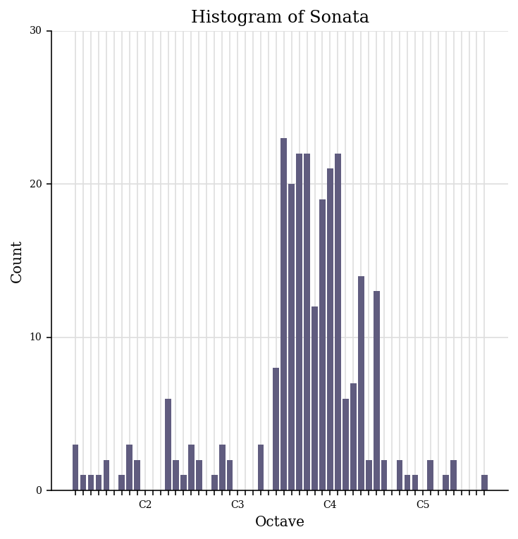
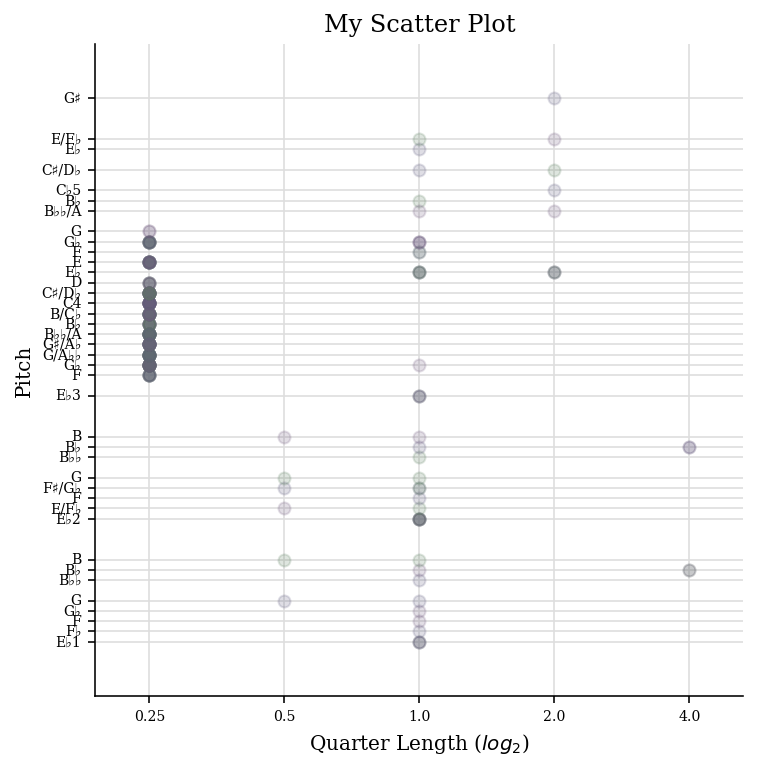
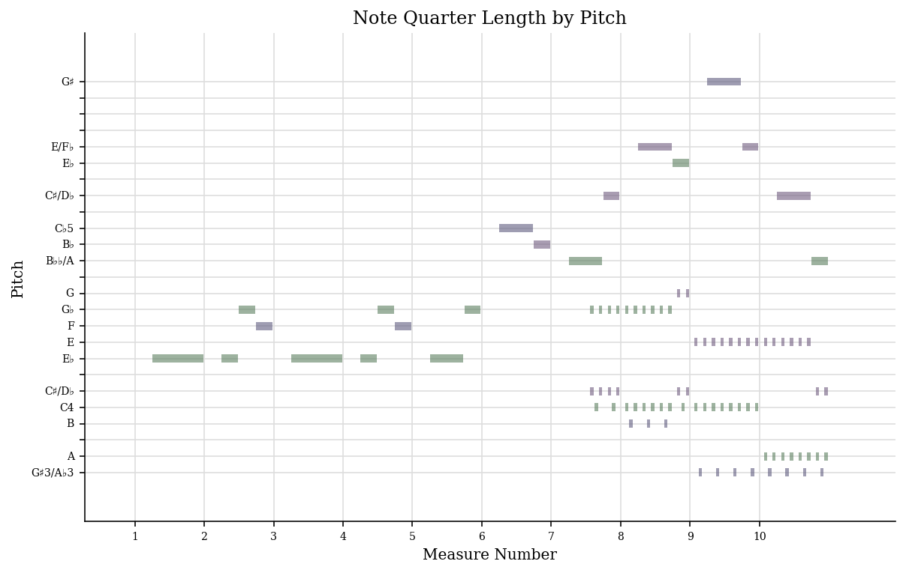

# MCA

## Week 1 
The theme for my dataset is the French composer Paul Dukas. Paul Dukas was known for his orchestral piece 'L'apprenti sorcier', with other works including 'Sonata in E-flat minor', 'Symphony in C' etc. His compositions were influenced by composers such as Beethoven, Berlioz, Franck, d'Indy and Debussy.
He was very critical of his work and destroyed many of his projects. This in particular interested me to choose him as my theme since I wanted to learn more about the pieces he decided to keep.

Descriptive data: On IMSLP, descriptive data about each piece of music is shown at the bottom of the screen. For example it describes when the piece was composed, how many movements there are within it, the average duration of the piece and so on. The individual sections also have more data relating to who created the score/who performed the track. An exmaple can be seen below. I think there should be more though.

Notated data: Almost all of his pieces are available via manuscript or computerised form. Websites such as IMSLP however it is also available to purchase from 

Acoustic Data: Paul Dukas' works are easily accessible to listen to via streaming sites such as Spotify, as well as websites like IMSLP.

## Week 2

The piece of music I decided to transcribe was Paul Dukas' Piano Sonata in E-flat Minor. I was able to successfully download the pdf of the score, however when trying to convert it into Musescore file it was unsuccessful as it said my file had been corrupted. So, I manually inputed the piece into musescore. 

Accesss the Musescore file [here](sonata-pauldukas-legit.mscz)

## Week 3

Loading Week 3 file...

If Verovio does not show the MEI file, it can also be accessed [here](https://anmol-d21.github.io/MCA-2021/verovio.html)

## Week 4
The features I believe are interesting for my piece after generating a jSymbolic analysis are:

upload excel file onto here and the image files

Access the excel file [here](sonata-pauldukas-legit-features.csv)

## Week 5
To describe the 1000-song dataset in a meaningful way, I would use these metadata elements:
(Physically type them out here/take a pictures of before/after)
Also add screenshots of week 3 and week 5 (located in the week 5 folder)

Verovio file:

Loading Week 5 file...

Access the modified MEI file [here](data/sonata-pauldukas-week5.mei)

## Week 7

As I had added the copyright restrictions in week 5, I only added the genre classification to my revised MEI file as well as double-checking to make sure my previous added metadata was fine.

Access the modified MEI file [here](data/sonata-pauldukas-week7.mei)

## Week 8

Add images 

Time-frequency analysis allows for a better tool to extract information of the piece of music. From the spectogram, we can see and understand approxiamately what notes are being played as it relates to the frequency. 
However the waveform analysis

Looking at the spectogram, it is more clear where the 

## Week 9 
Add images

## Week 10
Add images
From the similarity matrix we can see my chosen tracks are clusted near the other 'classical' tracks. This makes sense as Paul Dukas is a classical composer.

A lot of the track has been distorted. For example, the tempo has changed drastically, loads of the notes are different as well as the grace notes and articulations. It has kept the same time signature but deleted all the text surrounding the staves.
